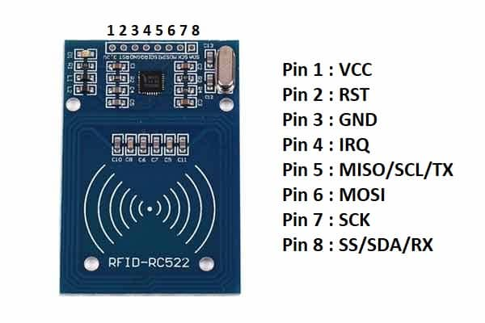

# STM32 RFID RC522

This project demonstrates how to interface the **MFRC522 RFID reader** with an **STM32F4 microcontroller** using **SPI communication**. The goal is to perform **RFID card detection, reading, and writing** operations, with real-time output over **USART2 via a TTL-to-USB converter**.


*RFID RC522 Module*

<hr>

## Hardware Required

- STM32F407VG development board
- MFRC522 RFID Module
- 13.56 MHz RFID tag or card (MIFARE Classic)
- TTL to USB converter (for UART output via USART2)
- Jumper wires

<hr>

## Pin Configuration

### MFRC522 to STM32 (SPI1)

| MFRC522 Pin | STM32F407VG Pin | Function         |
|-------------|------------------|------------------|
| SDA (SS)    | PA4              | SPI1_NSS         |
| SCK         | PA5              | SPI1_SCK         |
| MOSI        | PA7              | SPI1_MOSI        |
| MISO        | PA6              | SPI1_MISO        |
| RST         | PB0              | Reset            |
| 3.3V        | 3.3V             | Power Supply     |
| GND         | GND              | Ground           |

### TTL to USB (USART2)

| TTL to USB | STM32F407VG Pin | Function         |
|------------|------------------|------------------|
| TX         | PA3              | USART2_RX        |
| RX         | PA2              | USART2_TX        |
| GND        | GND              | Common Ground    |

## Software Requirements

- STM32CubeIDE (or Keil MDK)
- STM32 HAL Library
- UART terminal (e.g., Tera Term, PuTTY)

## How It Works

1. SPI and GPIOs are initialized.
2. MFRC522 module is reset and configured.
3. Program continuously checks for nearby RFID cards.
4. When a card is detected:
   - UID is read and printed via USART2 (visible in serial terminal).
   - Read/write operations can be performed on specific blocks.

<hr>
    
## File Structure

```
/Core
  └── Src
      ├── main.c
      ├── RC522.c
  └── Inc
      ├── main.h
      ├── RC522.h
```

> Note: Change the modules and pins that you want to use in the header file.

<hr>

## Main Code 

```c
/* Private user code ---------------------------------------------------------*/
/* USER CODE BEGIN 0 */

#include "RC522.h"
#include "string.h"

uint8_t status;
uint8_t str[16];
uint8_t sNum[5];
char *msg1 = "Reading From Card\r\n";
char *msg2 = "Reading From Tag\r\n";
char *msg3 = "Place card to read\r\n";

uint8_t my_card[] 	= {0x53, 0xc1, 0x84, 0x11, 0x07};
uint8_t my_tag[]  	= {0xd3, 0x0c, 0x32, 0xf8, 0x15};

int __io_putchar(int ch)
{
    HAL_UART_Transmit(&huart2, (uint8_t*)&ch, 1, HAL_MAX_DELAY);
    return ch;
}

/* USER CODE END 0 */
.
.
.
int main(void)
{
.
.
.
  /* USER CODE BEGIN 2 */

  MFRC522_Init();
  printf("The Program is starting...\n\n");
  HAL_Delay(200);
  /* USER CODE END 2 */
  
  /* Infinite loop */
  /* USER CODE BEGIN WHILE */
  while (1)
  {
    /* USER CODE END WHILE */

    /* USER CODE BEGIN 3 */
	status = MFRC522_Request(PICC_REQIDL, str);
	status = MFRC522_Anticoll(str);
	memcpy(sNum, str, 5);
	HAL_Delay(500);
	if((str[0]==my_card[0]) && (str[1]==my_card[1]) && (str[2]==my_card[2]) && (str[3]==my_card[3]) && (str[4]==my_card[4]) ) //CARD
	{
		printf("%s\n", msg1);
	}
	if((str[0]==my_tag[0]) && (str[1]==my_tag[1]) && (str[2]==my_tag[2]) && (str[3]==my_tag[3]) && (str[4]==my_tag[4]) ) //TAG
	{
		printf("%s\n", msg2);
	}
  }
  /* USER CODE END 3 */
  .
  .
  .
```
<hr>

## License

This project is licensed under the MIT License. See the [LICENSE](LICENSE) file for details.
<hr>
## ✍️ Developer

**Semi Eren Gökyıldız**